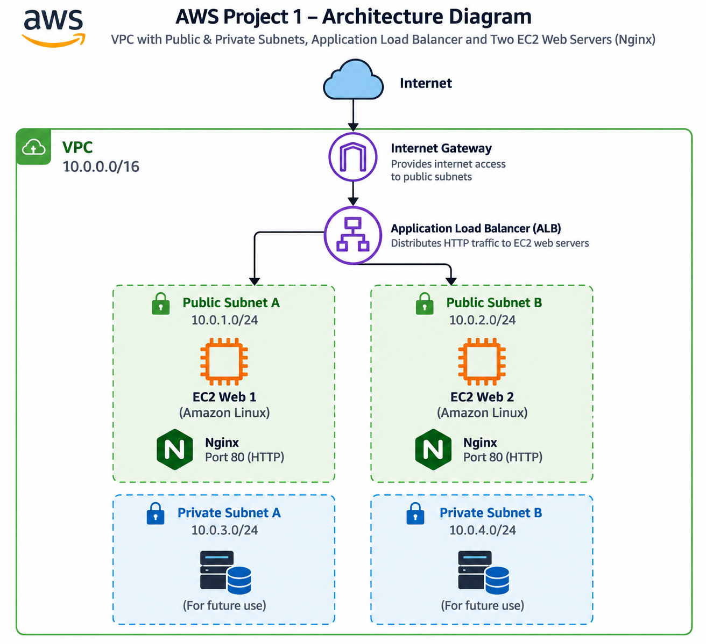

# aws-project1-high-availability-web
Highly available AWS web infrastructure using VPC, EC2, Nginx and Application Load Balancer.
# AWS Project 1 — Highly Available Web Infrastructure

## Project Overview

This project demonstrates a production-style AWS web infrastructure using:

- Amazon VPC
- Public and private subnets
- Internet Gateway
- Route Tables
- Security Groups
- Amazon EC2
- Nginx
- Application Load Balancer (ALB)

The objective was to build, validate, troubleshoot, and document a highly available web infrastructure across multiple Availability Zones.

---

## Architecture


```text
                         Internet
                            |
                            v
                    Internet Gateway
                            |
                            v
               Application Load Balancer
                       /          \
                      /            \
                     v              v
              EC2 Web Server 1   EC2 Web Server 2
              Nginx :80          Nginx :80
              Public Subnet A    Public Subnet B


## AWS Network Design

### VPC

- Name: `project1-vpc`
- CIDR: `10.0.0.0/16`

### Public Subnets

| Subnet | CIDR |
|---|---|
| `project1-public-a` | `10.0.1.0/24` |
| `project1-public-b` | `10.0.2.0/24` |

### Private Subnets

| Subnet | CIDR |
|---|---|
| `project1-private-a` | `10.0.11.0/24` |
| `project1-private-b` | `10.0.12.0/24` |

### Internet Gateway

- Name: `project1-igw`
- Attached to `project1-vpc`

### Route Tables

**Public Route Table**

- Name: `project1-public-rt`
- `0.0.0.0/0` → Internet Gateway
- Associated with both public subnets

**Private Route Table**

- Name: `project1-private-rt`
- Associated with both private subnets
- No direct Internet Gateway route
---

## Security Groups

### ALB Security Group

| Protocol | Port | Source |
|---|---:|---|
| HTTP | 80 | `0.0.0.0/0` |

This allows internet users to access the Application Load Balancer.

### EC2 Security Group

| Protocol | Port | Source |
|---|---:|---|
| HTTP | 80 | ALB Security Group |
| SSH | 22 | Restricted SSH access |

The EC2 servers receive HTTP traffic through the Application Load Balancer.

---

## EC2 Web Servers

Two Amazon Linux EC2 instances were deployed:

- `project web-1`
- `project web-2`

Both servers run Nginx on port 80.

Each server has a different webpage so that traffic through the Application Load Balancer can be identified.
---

## Nginx Configuration

Nginx was installed and configured as the web server on both EC2 instances.

### Verify Nginx Status

```bash
sudo systemctl is-active nginx
```

Expected result:

```text
active
```

### Verify Local Webpage


```bash
curl localhost
```

This confirms that the local web server is responding.

### Verify Port 80

```bash
sudo ss -tulpn | grep :80
```

This confirms that Nginx is listening on HTTP port 80.

### Enable Nginx at Boot

```bash
sudo systemctl enable nginx
```

This ensures Nginx starts automatically when the EC2 instance boots.
---

## Application Load Balancer

An Application Load Balancer (ALB) was configured to distribute HTTP traffic between the two EC2 web servers.

### Target Group

Both EC2 instances were registered as targets:

- `project web-1`
- `project web-2`

The ALB uses health checks to determine whether the web servers are available.

### Validation

The ALB DNS name was opened in a web browser.

Requests were successfully served by both EC2 web servers, confirming that the load balancer was distributing traffic between the targets.
---

## Log Investigation

Nginx logs were inspected to verify web server activity and troubleshoot potential issues.

### Access Log

```bash
sudo tail -20 /var/log/nginx/access.log
```

The access log showed successful HTTP requests with status code `200`.

ALB health-check requests were also visible in the access log.

### Error Log

```bash
sudo tail -20 /var/log/nginx/error.log
```

The inspected log entries showed Nginx startup and shutdown activity. No obvious Nginx serving error was identified during the inspection.

---

## Reboot Validation

Nginx was configured to start automatically after a server reboot.

### Check Nginx Startup Configuration

```bash
sudo systemctl is-enabled nginx
```

Expected result:

```text
enabled
```

### Reboot the Server

```bash
sudo reboot
```

After the EC2 instance became available again, Nginx was checked:

```bash
sudo systemctl is-active nginx
```

Expected result:

```text
active
```

This confirmed that Nginx automatically started after the EC2 instance reboot.
---

## Health Checks

The following checks were used to verify the health of the EC2 web servers.

### Check Nginx Service

```bash
sudo systemctl is-active nginx
```

Expected result:

```text
active
```

### Check Local HTTP Response

```bash
curl localhost
```

This confirms that the Nginx web server is responding locally.

### Check Listening Port

```bash
sudo ss -tulpn | grep :80
```

This confirms that Nginx is listening on HTTP port 80.

### Check ALB Target Health

The EC2 instances were checked through the Application Load Balancer target group.

Both targets were confirmed as healthy when both EC2 instances were running.
---

## Failure Testing

Failure testing was performed to verify how the infrastructure behaves when a component becomes unavailable.

### EC2 Instance Failure

One EC2 instance was stopped while the other instance remained running.

The Application Load Balancer detected the stopped target as unavailable.

The stopped EC2 instance was then started again, and both targets returned to a healthy state.

### Nginx Failure

Nginx service failure was also tested to verify service behavior and troubleshooting procedures.

### Reboot Test

The EC2 server was rebooted and Nginx was verified after the reboot.

Nginx returned to the `active` state automatically.

---

## Troubleshooting

Issues investigated during the project included:

- EC2 Instance Connect SSH connection problems
- Security Group SSH access
- Nginx service and log investigation
- EC2 reboot and service recovery
- Application Load Balancer target health
- ALB behavior when an EC2 target was unavailable

The troubleshooting process followed:

```text
Problem
   ↓
Symptoms
   ↓
Investigation
   ↓
Root Cause
   ↓
Fix
   ↓
Validation
```
---

## What I Learned

- How to design a VPC with public and private subnets
- How route tables control network traffic
- How an Internet Gateway provides internet connectivity
- How Security Groups control network access
- How to deploy and manage Nginx on Amazon Linux
- How an Application Load Balancer distributes traffic
- How ALB health checks determine target health
- How to inspect Nginx access and error logs
- How to verify Linux services using `systemctl`
- How to troubleshoot AWS and Linux connectivity issues
- How to verify automatic service recovery after an EC2 reboot

---

## Project Status

- [x] VPC and networking
- [x] Public and private subnets
- [x] Internet Gateway
- [x] Route tables
- [x] Security Groups
- [x] Two EC2 web servers
- [x] Nginx
- [x] Application Load Balancer
- [x] Target group
- [x] Health checks
- [x] Nginx log investigation
- [x] Reboot validation
- [x] Failure testing
- [x] Troubleshooting
- [x] Documentation
